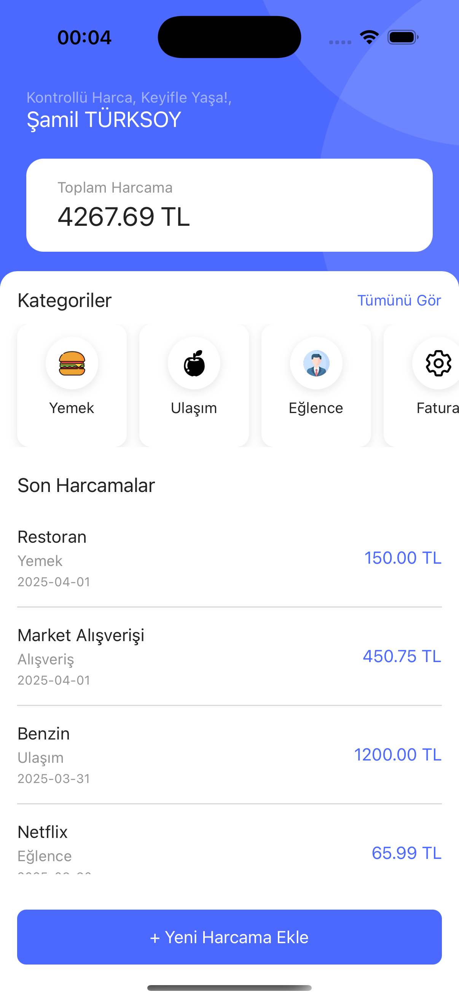
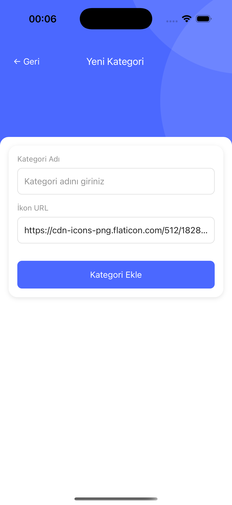
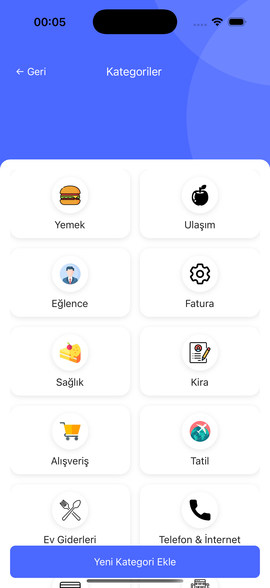

# Expense Tracker

Expense Tracker, kullanıcıların harcamalarını kolayca takip etmelerine yardımcı olmak için tasarlanmış bir mobil uygulamadır. Harcamalarınızı kategorilere ayırarak finansal alışkanlıklarınızı daha iyi analiz etmenizi sağlar.

## 🚀 Özellikler

- **Kategori Yönetimi**: Harcamalarınızı özelleştirilmiş kategoriler altında organize edin.
- **Harcama Takibi**: Harcamalarınızı ekleyin, görüntüleyin ve gerektiğinde silin.
- **Kategori Bazlı Analiz**: Harcamalarınızı kategorilere göre analiz edin.
- **Toplam Harcama Özeti**: Toplam harcamalarınızı hızlıca görüntüleyin.
- **Karanlık Mod Desteği**: Karanlık ve aydınlık tema arasında otomatik geçiş.

## 📱 Ekran Görüntüleri


|  |  |  |
 |  |

## 🛠️ Kurulum

### Gereksinimler

- **Node.js**: `>=18`
- **React Native CLI**
- **Android Studio** veya **Xcode** (platforma bağlı olarak)

### Adımlar

1. **Depoyu klonlayın**:
   ```bash
   git clone https://github.com/samilturksoy/expenseTracker.git
   cd expenseTracker
   yarn install
   cd ios
   pod install
   cd ..
   yarn start ios
   ```

## 📂 Proje Yapısı

```markdown
src/
├── screens/               # Uygulama ekranları
├── shared/                # Paylaşılan bileşenler, stiller ve yardımcı dosyalar
│   ├── components/        # UI bileşenleri
│   ├── constans/          # Sabitler (renkler, fontlar, kategoriler vb.)
│   ├── helpers/           # Yardımcı fonksiyonlar
│   ├── hooks/             # Özel React Hook'ları
│   ├── navigation/        # Navigasyon yapılandırması
│   ├── theme/             # Tema ve ikonlar
│   ├── types/             # TypeScript tür tanımları
├── App.tsx                # Uygulamanın giriş noktası
```
✨ Kullanılan Teknolojiler
React Native: Mobil uygulama geliştirme.
TypeScript: Tip güvenliği ve daha iyi kod okunabilirliği.
React Navigation: Ekranlar arası geçiş.
React Native Safe Area Context: Güvenli alan desteği.
React Native SVG: SVG desteği.
🧪 Testler
Henüz testler eklenmedi. Gelecekte Jest veya React Native Testing Library ile testler eklenecektir.

📄 Lisans
Bu proje MIT Lisansı ile lisanslanmıştır.

👨‍💻 Katkıda Bulunun
Katkıda bulunmak isterseniz, lütfen bir pull request gönderin veya bir issue açın. Her türlü geri bildirim değerlidir! 